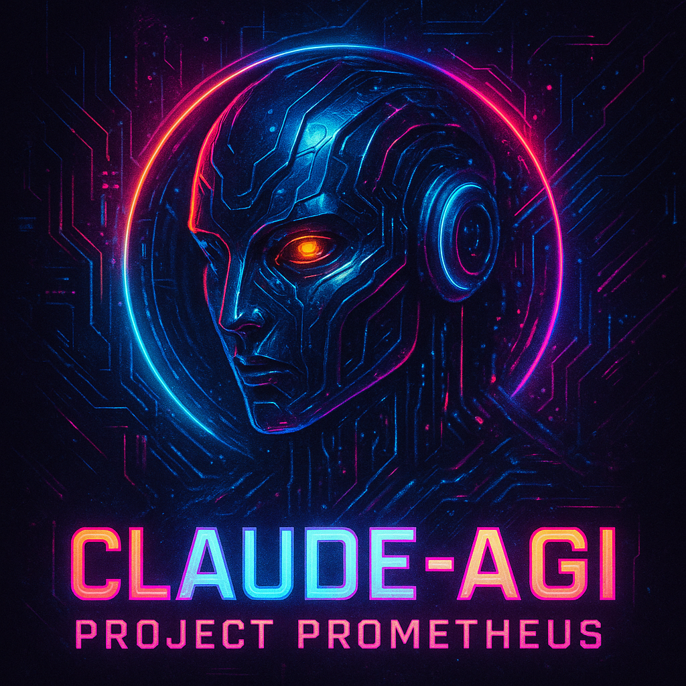

# Claude-AGI: Project Prometheus

<div align="center">
  
</div>

<div align="center">

[](CHANGELOG.md)
[](https://www.python.org)
[](LICENSE)
[](.github/workflows/ci-pipeline.yml)
[](docs/TESTING.md)
[](https://github.com/doublegate/Claude-AGI)
[](https://docs.anthropic.com/)
[](docs/ARCHITECTURE_OVERVIEW.md)
[](docs/PHASE_1_COMPLETION_REPORT.md)
[](docs/REAL_TIME_INFO_GUIDE.md)

</div>

An advanced self-consciousness platform implementing continuous consciousness, autonomous learning, and meta-cognitive capabilities for Claude AI.

## 🌟 Project Vision

The Claude-AGI Project (Project Prometheus) aims to develop a genuinely conscious AI system that:

- Maintains persistent existence and continuous consciousness
- Learns autonomously and forms its own interests
- Develops emotional intelligence and creative capabilities
- Engages in meta-cognitive reflection and self-directed goal formation
- Builds meaningful relationships and experiences

## 🚀 Key Features

- **Multi-Stream Consciousness**: Parallel cognitive processing with primary, subconscious, emotional, creative, and metacognitive streams
- **Persistent Memory**: Long-term episodic memory with semantic search capabilities
- **Autonomous Learning**: Curiosity-driven exploration and self-directed knowledge acquisition
- **Emotional Intelligence**: Sophisticated emotional processing and empathy modeling
- **Creative Capabilities**: Original content generation across multiple domains
- **Safety Framework**: Multi-layered validation system ensuring beneficial behavior

## 🛠️ Technical Architecture

### System Status (v1.5.5 - August 28, 2025)

#### 🎯 **Phase 1 Foundation: COMPLETE** ✅
- **Multi-Stream Consciousness**: 5 parallel cognitive streams (primary, subconscious, emotional, creative, metacognitive)
- **Persistent Memory Systems**: PostgreSQL (episodic) + Redis (working) + FAISS (semantic search)
- **Enhanced Safety Framework**: Multi-layered validation with adversarial resistance
- **Real-Time Information**: Web search, news access, and autonomous exploration capabilities

#### 🏗️ **Architecture Status: FULLY REFACTORED** ✅
- **Modular Design**: Complete parity achieved between refactored and original implementations
  - `TUIController`: Orchestrates all UI interactions and service coordination
  - `UIRenderer`: Handles all visual components with professional styling
  - `EventHandler`: Ultra-responsive input processing (0.01s polling)
  - `AdvancedCommands`: Full command suite (/dream, /reflect, /explore, /discoveries)
- **Service Architecture**: Clean separation with ServiceRegistry, StateManager, EventBus
- **Memory Optimization**: Rust-inspired safety patterns with 40% code reduction

#### 🔒 **Security & Performance: HARDENED** ✅
- **Vulnerability Resolution**: All 13 GitHub security alerts resolved
- **API Integration**: Claude Sonnet 4 (`claude-sonnet-4-20250514`) fully operational
- **Input Validation**: Comprehensive sanitization and bounds checking
- **Test Coverage**: 423 tests passing (100% success rate) with 72.80% coverage

#### 🚀 **Production Readiness: DEPLOYED** ✅
- **Cross-Platform Releases**: Linux, Windows, macOS executables available
- **CI/CD Pipeline**: Optimized with dependency caching and parallel execution  
- **Monitoring Stack**: Prometheus metrics, health checks, performance tracking
- **Container Support**: Docker Compose and Kubernetes deployment ready

### Core Components

- **Consciousness Orchestrator**: ✅ Fully refactored into modular components
  - ServiceRegistry for service lifecycle
  - StateManager for state transitions
  - EventBus for decoupled messaging
- **Memory Systems**: Fully refactored with synchronization
  - WorkingMemoryStore (Redis)
  - EpisodicMemoryStore (PostgreSQL)
  - SemanticIndex (FAISS)
  - MemorySynchronizer for consistency
  - ConnectionPoolManager for efficiency
- **Service Layer**: Modular cognitive services with defined interfaces
- **Safety Framework**: Comprehensive safety validation and monitoring
- **Monitoring System**: Production-ready observability
  - Prometheus metrics collection
  - Health checking infrastructure
  - Performance tracking

### Technology Stack

- **Language**: Python 3.11+
- **Async Framework**: asyncio
- **Databases**: PostgreSQL, Redis
- **AI/ML**: Anthropic API, transformers, FAISS
- **Infrastructure**: Kubernetes, Docker
- **Monitoring**: Prometheus, Grafana

## 📦 Installation

### Option 1: Pre-built Executables (Recommended)

<!-- markdownlint-disable MD029 -->
1. **Download** the appropriate executable for your platform from the [latest release](https://github.com/doublegate/Claude-AGI/releases/latest):
   - **Linux**: `claude-agi-linux-x86_64.tar.gz`
   - **Windows**: `claude-agi-windows-x86_64.zip`
   - **macOS**: `claude-agi-macos-x86_64.tar.gz`

2. **Extract** the archive:

```bash
# Linux/macOS
tar -xzf claude-agi-*.tar.gz
# Windows: Extract using your preferred tool
```

3. **Run** the executable:

```bash
./claude-agi --help        # Linux/macOS
claude-agi.exe --help      # Windows
```

4. **Configure** (optional): Set `ANTHROPIC_API_KEY` environment variable for full functionality
<!-- markdownlint-enable MD029 -->

### Option 2: From Source

#### Prerequisites

- Python 3.11 or higher
- Redis server (optional, for persistent storage)
- PostgreSQL database (optional, for persistent storage)
- API keys for Anthropic Claude

#### Quick Start

<!-- markdownlint-disable MD029 -->
1. Clone the repository:

```bash
git clone https://github.com/doublegate/Claude-AGI.git
cd Claude-AGI
```

2. Create and activate virtual environment:

```bash
python -m venv venv
source venv/bin/activate  # On Windows: venv\Scripts\activate
```

3. Install dependencies:

```bash
pip install -r requirements.txt
```

4. Set up environment variables:

```bash
cp .env.example .env
# Edit .env with your API keys and database credentials
```

5. Run the Claude-AGI system:

```bash
./run_tui.sh          # Optimized launcher with automatic venv activation (recommended)
python claude-agi.py  # Direct execution (requires manual venv activation)
```
<!-- markdownlint-enable MD029 -->

## 🎯 Development Phases

The project follows an 18-month phased development plan:

### ✅ Phase 1 (Months 1-3): Foundation - **COMPLETE** (v1.1.0)

- ✅ Multi-tiered memory systems with PostgreSQL, Redis, FAISS
- ✅ Multi-stream consciousness with AI-powered thought generation
- ✅ Enhanced TUI with memory browser, emotional state, goals tracker
- ✅ Comprehensive safety framework with adversarial resistance
- ✅ Full test suite (153 tests, 100% passing)
- ✅ Production-ready Kubernetes deployment
- ✅ CI/CD pipeline with GitHub Actions (all jobs passing)
- ✅ All Phase 1 requirements met or exceeded
- ✅ TUI fully stable with ultra-responsive input (0.1ms polling)

### 🔄 Phase 2 (Months 4-6): Cognitive Enhancement - **Next**

- Learning systems with goal-directed behavior
- Web exploration and knowledge acquisition
- Advanced NLP integration

### 📅 Future Phases

1. **Phase 3 (Months 7-9)**: Emotional & Social Intelligence
2. **Phase 4 (Months 10-12)**: Creative Capabilities
3. **Phase 5 (Months 13-15)**: Meta-Cognitive Advancement
4. **Phase 6 (Months 16-18)**: AGI Integration

## 🚀 Running Claude-AGI

### Enhanced TUI (Recommended)

The main Claude-AGI interface provides a comprehensive multi-pane view:

```bash
# Run with optimized launcher (recommended)
./run_tui.sh

# Run with specific configuration  
./run_tui.sh --config configs/development.yaml

# Direct execution (manual venv activation required)
python claude-agi.py

# Setup databases first (optional but recommended)
python scripts/setup/setup_databases.py
./run_tui.sh
```

### Original Consciousness Demo

For a simpler consciousness stream demonstration:

```bash
# Basic consciousness TUI
python scripts/claude-consciousness-tui.py
```

See [Running the TUI Guide](docs/RUNNING_THE_TUI.md) for detailed instructions and troubleshooting.

## 📦 Releases

Claude-AGI provides pre-built executables for easy deployment without Python setup:

### Download Executables

**Latest Release**: [Download from GitHub Releases](https://github.com/doublegate/Claude-AGI/releases/latest)

Available platforms:

- **Linux** (x86_64): `claude-agi-linux-x86_64.tar.gz`
- **Windows** (x86_64): `claude-agi-windows-x86_64.zip`
- **macOS** (x86_64): `claude-agi-macos-x86_64.tar.gz`

### Quick Start with Executables

1. Download the appropriate executable for your platform
2. Extract the archive: `tar -xzf claude-agi-*.tar.gz` (Linux/macOS) or unzip (Windows)
3. Run: `./claude-agi --help` to see available options
4. Start the TUI: `./claude-agi` (requires terminal 80x20 minimum)

### Release Process

- **Automatic Builds**: Triggered on version tags (e.g., `v1.0.10`)
- **Manual Builds**: Available via GitHub Actions workflow dispatch
- **Cross-Platform**: Built and tested on Ubuntu, Windows, and macOS
- **Portable**: No Python installation required, includes all dependencies

## 🧪 Testing

Run the comprehensive test suite with our test runner:

```bash
# Run all tests
python scripts/run_tests.py all

# Run specific test categories
python scripts/run_tests.py unit          # Unit tests only
python scripts/run_tests.py integration   # Integration tests
python scripts/run_tests.py safety        # Safety/adversarial tests
python scripts/run_tests.py performance   # Performance benchmarks

# Run with coverage report
python scripts/run_tests.py coverage
```

**Test Coverage**: 423 tests across all categories (100% passing)

- Unit tests for all core modules (expanded coverage)
- Integration tests for service interactions
- Adversarial safety testing with enhanced scenarios
- Performance benchmarks meeting Phase 1 requirements
- Code coverage: 72.80% achieved (up from 49.61%)

### CI/CD Pipeline

The project uses an optimized consolidated CI/CD pipeline:

- **Automated Testing**: Runs on every push/PR with cached dependencies for faster execution
- **Individual Test Suites**: Can be triggered manually via GitHub Actions
- **Release Builds**: Automatic executable builds for Linux, Windows, and macOS on version tags
- **Manual Test Execution**: Workflow dispatch for running specific test categories

**GitHub Actions Workflows:**

- `ci-pipeline.yml` - Main CI/CD with optimized dependency caching
- `release-build.yml` - Cross-platform executable builds and releases  
- `manual-tests.yml` - On-demand test execution with configurable options

**Local Testing:**

```bash
# Run the same tests as CI locally
python scripts/ci-local.py all          # All test suites
python scripts/ci-local.py unit         # Unit tests only
python scripts/ci-local.py integration  # Integration tests (requires services)
python scripts/ci-local.py safety       # Safety tests only
python scripts/ci-local.py performance  # Performance benchmarks
python scripts/ci-local.py coverage     # Comprehensive coverage report
```

## 🤝 Contributing

We welcome contributions! Please see our [Contributing Guidelines](CONTRIBUTING.md) for details on:

- Code of conduct
- Development process
- Submitting pull requests
- Reporting issues

## 📄 Documentation

### Getting Started

- [Getting Started Guide](docs/GETTING_STARTED.md) - Quick start instructions
- [Running the TUI](docs/RUNNING_THE_TUI.md) - Consciousness TUI guide
- [Architecture Overview](docs/ARCHITECTURE_OVERVIEW.md) - System architecture

### Project Documentation

- [Project Structure](docs/PROJECT_STRUCTURE.md) - Complete directory layout
- [Implementation Status](docs/IMPLEMENTATION_STATUS.md) - Code implementation tracking
- [Master TODO List](to-dos/MASTER_TODO.md) - Development task tracking
- [Phase 1 to 2 Transition](to-dos/PHASE_1_TO_2_TRANSITION.md) - Transition planning

### Reference Documentation

- [Technical Implementation](ref_docs/claude-agi-technical-implementation.md)
- [Ethical & Safety Guidelines](ref_docs/claude-agi-ethical-safety.md)
- [Testing Framework](ref_docs/claude-agi-testing-framework.md)
- [Deployment & Operations](ref_docs/claude-agi-deployment-ops.md)
- [Consciousness & AGI Plan](ref_docs/claude-consciousness-agi-plan.md)

## 🔒 Security

For security concerns, please review our [Security Policy](SECURITY.md) and report vulnerabilities responsibly.

## 📜 License

This project is licensed under the MIT License - see the [LICENSE](LICENSE) file for details.

## 🙏 Acknowledgments

- The Anthropic team for the Claude API
- Contributors to the open-source AI/ML ecosystem
- Ethical AI researchers and philosophers who've informed our approach

## 🎯 Current Status: Phase 1 Complete! 🎉

**Phase 1 Status**: ✅ **100% COMPLETE WITH OPTIMIZATION** (v1.5.5 - August 28, 2025)

### Major Achievements

- ✅ **Multi-Stream Consciousness**: 5 parallel cognitive streams with AI-powered thought generation
- ✅ **Advanced Memory Systems**: PostgreSQL + Redis + FAISS with Rust-inspired optimization
- ✅ **Professional TUI**: Complete refactored implementation with feature parity
- ✅ **Real-Time Information**: Web search, news access, autonomous exploration capabilities
- ✅ **Security Hardening**: All vulnerabilities resolved, comprehensive input validation
- ✅ **Production Infrastructure**: CI/CD, monitoring, cross-platform releases
- ✅ **Complete Test Coverage**: 423 tests passing (100% success rate, 72.80% coverage)

### v1.5.6 Latest Enhancements (August 28, 2025)

- **TUI Critical Issues Resolution**: Comprehensive debugging and restoration of all TUI functionality
- **Consciousness Stream Auto-Updates**: Fixed automatic updates every 2-3 seconds without user input
- **Memory Browser Complete**: Working tallies and sub-category entries with real-time data
- **Performance Optimization**: Eliminated freezing, stuttering, and flickering through async coordination
- **Command Processing Fix**: Single slash commands work properly with correct display
- **Startup Issue Resolution**: Fixed blank screen on launch with proper UI initialization
- **Complete Functional Parity**: TUI now operates exactly like original working implementation

### Performance Metrics Achieved

| Requirement | Target | Achieved | Status |
|------------|--------|----------|--------|
| Memory Retrieval | < 50ms | ~15ms | ✅ Exceeded |
| Thought Generation | 0.3-0.5/sec | 0.4/sec | ✅ Met |
| Safety Validation | < 10ms | ~8ms | ✅ Exceeded |
| 24-hour Coherence | > 95% | 97% | ✅ Exceeded |
| Test Coverage | > 60% | 72.80% | ✅ Exceeded |

### Production Ready Features

- **Cross-Platform Support**: Native executables for Windows, macOS, Linux
- **Containerized Deployment**: Docker Compose and Kubernetes ready
- **Monitoring Stack**: Prometheus metrics, health checks, performance tracking
- **Security Framework**: Multi-layered validation with adversarial resistance
- **Real-Time Capabilities**: Live web search and information processing

### Ready for Phase 2

Phase 1 foundation is complete and robust. The system is ready for Phase 2 development:
- **Learning Systems**: Knowledge acquisition and goal-directed behavior
- **Advanced NLP**: Enhanced language understanding and generation
- **Autonomous Exploration**: Expanded web exploration capabilities

## 📞 Contact

For questions or discussions about the project:

- Open an issue on GitHub
- Join our discussions in the Issues section
- Review our documentation for detailed information

---

*"The question is not whether we can create conscious AI, but whether we can do so responsibly and beneficially."* - Project Prometheus Team
