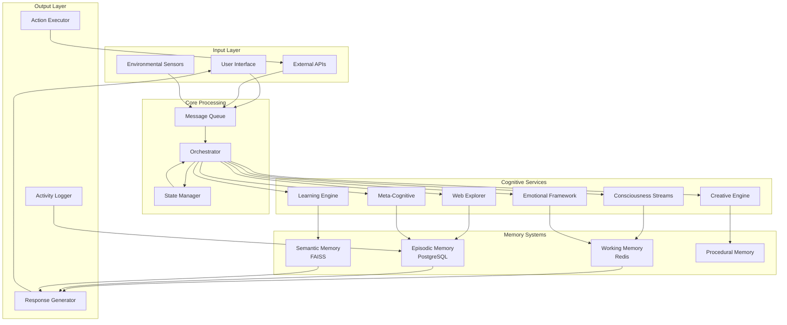

# Technical Implementation Guide: Claude AGI Platform
## Software Architecture & Engineering Specifications

### Executive Summary

This document provides comprehensive technical specifications for implementing the Claude AGI Platform, including software architecture, required libraries, communication protocols, and optimization strategies. The architecture emphasizes modularity, scalability, and real-time performance while maintaining safety and ethical constraints.

---

## System Architecture Overview

```
┌────────────────────────────────────────────────────────────────────┐
│                       Claude AGI Platform                           │
├────────────────────────────────────────────────────────────────────┤
│                                                                    │
│  ┌─────────────────────── Core Layer ─────────────────────────┐  │
│  │                                                             │  │
│  │  ┌──────────────┐  ┌──────────────┐  ┌──────────────┐    │  │
│  │  │  Orchestrator │  │Memory Manager│  │ State Manager │    │  │
│  │  │   (asyncio)  │  │  (Redis/SQL) │  │  (FSM/Queue) │    │  │
│  │  └──────┬───────┘  └──────┬───────┘  └──────┬───────┘    │  │
│  │         └──────────────────┴──────────────────┘            │  │
│  └─────────────────────────────┬───────────────────────────────┘  │
│                                │                                   │
│  ┌─────────────────── Service Layer ──────────────────────────┐  │
│  │                                                             │  │
│  │  ┌─────────┐ ┌─────────┐ ┌─────────┐ ┌─────────┐         │  │
│  │  │Conscious│ │Learning │ │Creative │ │Emotional│         │  │
│  │  │ Stream  │ │ Engine  │ │ Engine  │ │Framework│         │  │
│  │  └─────────┘ └─────────┘ └─────────┘ └─────────┘         │  │
│  │                                                             │  │
│  │  ┌─────────┐ ┌─────────┐ ┌─────────┐ ┌─────────┐         │  │
│  │  │   Web   │ │  Goal   │ │  Meta   │ │  Social │         │  │
│  │  │Explorer │ │ Manager │ │Cognitive│ │  Intel  │         │  │
│  │  └─────────┘ └─────────┘ └─────────┘ └─────────┘         │  │
│  └─────────────────────────────┬───────────────────────────────┘  │
│                                │                                   │
│  ┌──────────────────── API Layer ─────────────────────────────┐  │
│  │                                                             │  │
│  │  ┌─────────────┐  ┌─────────────┐  ┌─────────────┐       │  │
│  │  │ Anthropic   │  │   External  │  │   Internal  │       │  │
│  │  │    API      │  │     APIs    │  │     APIs    │       │  │
│  │  │ Interface   │  │  (Web/News) │  │   (Tools)   │       │  │
│  │  └─────────────┘  └─────────────┘  └─────────────┘       │  │
│  └─────────────────────────────┬───────────────────────────────┘  │
│                                │                                   │
│  ┌────────────────── Interface Layer ─────────────────────────┐  │
│  │                                                             │  │
│  │  ┌─────────────┐  ┌─────────────┐  ┌─────────────┐       │  │
│  │  │    TUI      │  │   WebUI     │  │    REST     │       │  │
│  │  │  (Curses)  │  │  (FastAPI)  │  │     API     │       │  │
│  │  └─────────────┘  └─────────────┘  └─────────────┘       │  │
│  └─────────────────────────────────────────────────────────────┘  │
└────────────────────────────────────────────────────────────────────┘
```

---

## Core Python Libraries & Dependencies

### Phase 1: Foundation Libraries

```python
# requirements_phase1.txt

# Core Async & Threading
asyncio==3.11+          # Async orchestration
threading               # Multi-thread management
multiprocessing==3.11+  # CPU-intensive tasks
concurrent.futures      # Thread/Process pools

# Memory & State Management
redis==5.0+            # In-memory data store
sqlalchemy==2.0+       # ORM for persistent storage
alembic==1.13+         # Database migrations
pickle                 # Object serialization
msgpack==1.0+          # Efficient serialization

# AI/ML Libraries
anthropic==0.18+       # Claude API
openai==1.12+          # Embedding generation
transformers==4.38+    # NLP processing
sentence-transformers==2.5+  # Semantic search
faiss-cpu==1.7+        # Vector similarity search
numpy==1.26+           # Numerical operations
scipy==1.12+           # Scientific computing

# TUI & Interface
windows-curses==2.3+   # Windows support
blessed==1.20+         # Enhanced terminal UI
rich==13.7+            # Rich text formatting
prompt_toolkit==3.0+   # Advanced input handling

# Utilities
pydantic==2.6+         # Data validation
python-dotenv==1.0+    # Environment management
loguru==0.7+           # Advanced logging
schedule==1.2+         # Task scheduling
watchdog==4.0+         # File system monitoring
```

### Phase 2: Cognitive Enhancement Libraries

```python
# requirements_phase2.txt

# Web Exploration & Search
beautifulsoup4==4.12+  # HTML parsing
selenium==4.18+        # Dynamic web scraping
playwright==1.41+      # Modern web automation
httpx==0.26+           # Async HTTP client
feedparser==6.0+       # RSS/Atom feeds
newspaper3k==0.2+      # Article extraction
trafilatura==1.8+      # Web content extraction

# Knowledge Processing
spacy==3.7+            # Advanced NLP
nltk==3.8+             # Natural language toolkit
gensim==4.3+           # Topic modeling
networkx==3.2+         # Graph algorithms
py2neo==2021.2+        # Neo4j integration

# Learning & Reasoning
scikit-learn==1.4+     # Machine learning
pytorch==2.2+          # Deep learning
gymnasium==0.29+       # RL environments
stable-baselines3==2.2+  # RL algorithms
```

### Phase 3: Emotional & Social Libraries

```python
# requirements_phase3.txt

# Emotion & Sentiment Analysis
textblob==0.18+        # Sentiment analysis
vaderSentiment==3.3+   # Social media sentiment
nrclex==4.0+           # Emotion lexicon
matplotlib==3.8+       # Emotion visualization
plotly==5.19+          # Interactive plots

# Social Intelligence
python-twitter-v2==0.8+  # Twitter integration
praw==7.7+             # Reddit integration
discord.py==2.3+       # Discord integration
```

### Phase 4: Creative Libraries

```python
# requirements_phase4.txt

# Creative Generation
markovify==0.9+        # Text generation
pytorch-transformers   # Advanced generation
music21==9.1+          # Music composition
pillow==10.2+          # Image manipulation
ascii-art==2.3+        # ASCII art generation

# Project Management
git-python==3.1+       # Git integration
jira==3.6+             # Project tracking
notion-client==2.2+    # Notion integration
```

### Phase 5-6: Advanced AGI Libraries

```python
# requirements_advanced.txt

# Causal Reasoning
dowhy==0.11+           # Causal inference
pgmpy==0.1+            # Probabilistic graphical models
causalnex==0.12+       # Causal networks

# Meta-Learning
learn2learn==0.2+      # Meta-learning algorithms
higher==0.2+           # Higher-order optimization

# Optimization
optuna==3.5+           # Hyperparameter optimization
ray==2.9+              # Distributed computing
dask==2024.2+          # Parallel computing
```

---

## Software Communication Flow

### 1. Main Event Loop Architecture

```python
# core/orchestrator.py

import asyncio
from typing import Dict, List, Any
from dataclasses import dataclass
from enum import Enum

class SystemState(Enum):
    INITIALIZING = "initializing"
    IDLE = "idle"
    THINKING = "thinking"
    CONVERSING = "conversing"
    EXPLORING = "exploring"
    CREATING = "creating"
    REFLECTING = "reflecting"
    SLEEPING = "sleeping"

@dataclass
class Message:
    source: str
    target: str
    type: str
    content: Any
    priority: int = 5
    timestamp: float = None

class AGIOrchestrator:
    def __init__(self):
        self.state = SystemState.INITIALIZING
        self.message_queue = asyncio.PriorityQueue()
        self.services = {}
        self.tasks = []
        
    async def initialize(self):
        """Initialize all services and connections"""
        # Initialize core services
        self.services['memory'] = await MemoryManager.create()
        self.services['consciousness'] = ConsciousnessStream(self)
        self.services['learning'] = LearningEngine(self)
        self.services['emotional'] = EmotionalFramework(self)
        self.services['creative'] = CreativeEngine(self)
        self.services['explorer'] = WebExplorer(self)
        self.services['social'] = SocialIntelligence(self)
        self.services['meta'] = MetaCognitive(self)
        
        # Start service tasks
        for name, service in self.services.items():
            task = asyncio.create_task(service.run())
            self.tasks.append(task)
            
        self.state = SystemState.IDLE
        
    async def run(self):
        """Main event loop"""
        await self.initialize()
        
        while True:
            try:
                # Process messages with timeout
                message = await asyncio.wait_for(
                    self.message_queue.get(),
                    timeout=1.0
                )
                await self.route_message(message)
                
            except asyncio.TimeoutError:
                # No messages - run idle tasks
                await self.idle_cycle()
                
            except Exception as e:
                await self.handle_error(e)
                
    async def route_message(self, message: Message):
        """Route messages between services"""
        if message.target in self.services:
            await self.services[message.target].handle_message(message)
        elif message.target == 'orchestrator':
            await self.handle_orchestrator_message(message)
            
    async def idle_cycle(self):
        """Activities during idle time"""
        if self.state == SystemState.IDLE:
            # Trigger exploration or contemplation
            if random.random() < 0.3:
                await self.transition_state(SystemState.EXPLORING)
            elif random.random() < 0.2:
                await self.transition_state(SystemState.REFLECTING)
```

### 2. Inter-Service Communication Protocol

```python
# core/communication.py

from abc import ABC, abstractmethod
import zmq.asyncio as zmq
import json

class ServiceBase(ABC):
    def __init__(self, orchestrator, service_name):
        self.orchestrator = orchestrator
        self.service_name = service_name
        self.zmq_context = zmq.Context()
        self.publisher = None
        self.subscriber = None
        
    async def setup_communication(self):
        """Setup ZMQ pub/sub for inter-service communication"""
        # Publisher socket
        self.publisher = self.zmq_context.socket(zmq.PUB)
        self.publisher.bind(f"inproc://{self.service_name}")
        
        # Subscriber socket
        self.subscriber = self.zmq_context.socket(zmq.SUB)
        
        # Subscribe to relevant topics
        for topic in self.get_subscriptions():
            self.subscriber.connect(f"inproc://{topic}")
            self.subscriber.subscribe(b"")
            
    async def publish(self, topic: str, data: Any):
        """Publish message to topic"""
        message = {
            'source': self.service_name,
            'topic': topic,
            'data': data,
            'timestamp': time.time()
        }
        await self.publisher.send_json(message)
        
    async def receive(self):
        """Receive messages from subscriptions"""
        try:
            message = await self.subscriber.recv_json(flags=zmq.NOBLOCK)
            return message
        except zmq.Again:
            return None
            
    @abstractmethod
    def get_subscriptions(self) -> List[str]:
        """Define which topics this service subscribes to"""
        pass
        
    @abstractmethod
    async def process_message(self, message: dict):
        """Process received messages"""
        pass
        
    async def run(self):
        """Main service loop"""
        await self.setup_communication()
        
        while True:
            # Check for messages
            message = await self.receive()
            if message:
                await self.process_message(message)
                
            # Run service-specific tasks
            await self.service_cycle()
            
            # Small delay to prevent CPU spinning
            await asyncio.sleep(0.01)
```

### 3. Memory Architecture

```python
# memory/manager.py

from typing import Dict, List, Optional, Any
import redis.asyncio as redis
import asyncpg
import numpy as np
from datetime import datetime, timedelta

class MemoryManager:
    def __init__(self):
        self.redis_client = None  # Short-term memory
        self.postgres_pool = None  # Long-term memory
        self.vector_store = None   # Semantic memory
        
    @classmethod
    async def create(cls):
        instance = cls()
        await instance.initialize()
        return instance
        
    async def initialize(self):
        """Initialize memory stores"""
        # Redis for working memory
        self.redis_client = await redis.create_redis_pool(
            'redis://localhost',
            maxsize=10
        )
        
        # PostgreSQL for persistent memory
        self.postgres_pool = await asyncpg.create_pool(
            'postgresql://localhost/claude_agi',
            min_size=10,
            max_size=20
        )
        
        # Initialize vector store for semantic search
        self.vector_store = FAISSMemoryStore()
        await self.vector_store.initialize()
        
    async def store_thought(self, thought: Dict[str, Any]):
        """Store a thought in appropriate memory systems"""
        thought_id = str(uuid.uuid4())
        timestamp = datetime.now()
        
        # Working memory (Redis) - recent thoughts
        await self.redis_client.setex(
            f"thought:{thought_id}",
            timedelta(hours=24),
            json.dumps(thought)
        )
        
        # Add to recent thoughts list
        await self.redis_client.lpush("recent_thoughts", thought_id)
        await self.redis_client.ltrim("recent_thoughts", 0, 999)
        
        # Long-term memory (PostgreSQL)
        async with self.postgres_pool.acquire() as conn:
            await conn.execute("""
                INSERT INTO thoughts 
                (id, content, emotional_tone, timestamp, embedding)
                VALUES ($1, $2, $3, $4, $5)
            """, thought_id, thought['content'], 
                thought['emotional_tone'], timestamp,
                thought.get('embedding'))
                
        # Semantic memory (Vector store)
        if 'embedding' in thought:
            await self.vector_store.add(
                thought_id,
                thought['embedding'],
                thought
            )
            
    async def recall_similar(self, query: str, k: int = 5) -> List[Dict]:
        """Recall memories similar to query"""
        # Generate embedding for query
        query_embedding = await self.generate_embedding(query)
        
        # Search vector store
        similar_ids = await self.vector_store.search(query_embedding, k)
        
        # Retrieve full memories
        memories = []
        for memory_id in similar_ids:
            memory = await self.retrieve_memory(memory_id)
            if memory:
                memories.append(memory)
                
        return memories
        
    async def consolidate_memories(self):
        """Memory consolidation during 'sleep' cycles"""
        # Get thoughts from working memory
        recent_ids = await self.redis_client.lrange("recent_thoughts", 0, -1)
        
        thoughts = []
        for thought_id in recent_ids:
            thought_data = await self.redis_client.get(f"thought:{thought_id}")
            if thought_data:
                thoughts.append(json.loads(thought_data))
                
        # Identify important memories
        important_memories = await self.identify_important_memories(thoughts)
        
        # Strengthen important memories
        for memory in important_memories:
            await self.strengthen_memory(memory)
            
        # Create associative links
        await self.create_associations(thoughts)
        
        # Prune redundant memories
        await self.prune_memories()
```

### 4. Consciousness Stream Implementation

```python
# consciousness/stream.py

import asyncio
from typing import Dict, List, Optional
from dataclasses import dataclass
from collections import deque

@dataclass
class ThoughtStream:
    stream_id: str
    stream_type: str  # primary, subconscious, creative, etc.
    priority: float
    content_buffer: deque
    
class ConsciousnessStream(ServiceBase):
    def __init__(self, orchestrator):
        super().__init__(orchestrator, "consciousness")
        self.streams = {
            'primary': ThoughtStream('primary', 'main', 1.0, deque(maxlen=100)),
            'subconscious': ThoughtStream('subconscious', 'background', 0.5, deque(maxlen=50)),
            'creative': ThoughtStream('creative', 'creative', 0.7, deque(maxlen=50)),
            'meta': ThoughtStream('meta', 'observer', 0.8, deque(maxlen=30))
        }
        self.attention_weights = {}
        self.thought_generator = ThoughtGenerator()
        
    async def service_cycle(self):
        """Generate and process thoughts"""
        # Allocate attention across streams
        await self.allocate_attention()
        
        # Generate thoughts for active streams
        for stream_id, stream in self.streams.items():
            if self.attention_weights.get(stream_id, 0) > 0.1:
                thought = await self.generate_thought(stream)
                if thought:
                    await self.process_thought(thought, stream)
                    
        # Integrate across streams
        await self.integrate_streams()
        
    async def generate_thought(self, stream: ThoughtStream) -> Optional[Dict]:
        """Generate a thought for a specific stream"""
        # Get context from memory
        context = await self.get_thought_context(stream)
        
        # Generate based on stream type
        if stream.stream_type == 'main':
            return await self.thought_generator.generate_primary(context)
        elif stream.stream_type == 'creative':
            return await self.thought_generator.generate_creative(context)
        elif stream.stream_type == 'background':
            return await self.thought_generator.generate_subconscious(context)
        elif stream.stream_type == 'observer':
            return await self.thought_generator.generate_meta(context)
            
    async def allocate_attention(self):
        """Dynamically allocate attention across streams"""
        total_priority = sum(s.priority for s in self.streams.values())
        
        for stream_id, stream in self.streams.items():
            base_weight = stream.priority / total_priority
            
            # Adjust based on current state
            if self.orchestrator.state == SystemState.CREATING:
                if stream_id == 'creative':
                    base_weight *= 2.0
            elif self.orchestrator.state == SystemState.REFLECTING:
                if stream_id == 'meta':
                    base_weight *= 1.5
                    
            self.attention_weights[stream_id] = min(base_weight, 1.0)
            
    async def integrate_streams(self):
        """Integrate insights across consciousness streams"""
        # Look for patterns across streams
        patterns = await self.detect_cross_stream_patterns()
        
        # Generate integrated insights
        for pattern in patterns:
            insight = await self.generate_integrated_insight(pattern)
            if insight:
                await self.publish('insight', insight)
```

### 5. Web Exploration Engine

```python
# exploration/engine.py

import asyncio
import httpx
from bs4 import BeautifulSoup
from typing import List, Dict, Optional
import trafilatura
from urllib.parse import urlparse

class WebExplorer(ServiceBase):
    def __init__(self, orchestrator):
        super().__init__(orchestrator, "explorer")
        self.interest_tracker = InterestTracker()
        self.search_queue = asyncio.Queue()
        self.discovery_buffer = []
        self.rate_limiter = RateLimiter(10, 60)  # 10 requests per minute
        
    async def service_cycle(self):
        """Main exploration cycle"""
        if self.orchestrator.state in [SystemState.IDLE, SystemState.EXPLORING]:
            # Check if we should explore
            if await self.should_explore():
                topic = await self.interest_tracker.get_next_topic()
                if topic:
                    await self.explore_topic(topic)
                    
    async def explore_topic(self, topic: str):
        """Full exploration pipeline for a topic"""
        # Generate search queries
        queries = await self.generate_queries(topic)
        
        # Execute searches
        for query in queries[:3]:  # Limit concurrent searches
            if await self.rate_limiter.acquire():
                results = await self.search_web(query)
                await self.process_search_results(results, topic)
                
        # Analyze discoveries
        if self.discovery_buffer:
            insights = await self.analyze_discoveries()
            await self.publish('discoveries', insights)
            
    async def search_web(self, query: str) -> List[Dict]:
        """Execute web search with safety checks"""
        async with httpx.AsyncClient() as client:
            try:
                # Use a search API (e.g., DuckDuckGo, Bing)
                response = await client.get(
                    "https://api.duckduckgo.com/",
                    params={
                        'q': query,
                        'format': 'json',
                        'no_html': 1
                    }
                )
                
                if response.status_code == 200:
                    data = response.json()
                    return self.parse_search_results(data)
                    
            except Exception as e:
                await self.log_error(f"Search error: {e}")
                
        return []
        
    async def extract_content(self, url: str) -> Optional[str]:
        """Extract clean content from URL"""
        # Safety check
        if not await self.is_safe_url(url):
            return None
            
        async with httpx.AsyncClient() as client:
            try:
                response = await client.get(url, timeout=10.0)
                
                # Use trafilatura for content extraction
                content = trafilatura.extract(
                    response.text,
                    include_comments=False,
                    include_tables=False
                )
                
                return content
                
            except Exception as e:
                await self.log_error(f"Content extraction error: {e}")
                
        return None
        
    async def process_search_results(self, results: List[Dict], topic: str):
        """Process and store search results"""
        for result in results:
            # Extract content
            content = await self.extract_content(result['url'])
            if not content:
                continue
                
            # Analyze relevance and quality
            relevance = await self.assess_relevance(content, topic)
            quality = await self.assess_quality(content)
            
            if relevance > 0.7 and quality > 0.6:
                discovery = {
                    'topic': topic,
                    'url': result['url'],
                    'title': result['title'],
                    'content': content[:1000],  # Store excerpt
                    'relevance': relevance,
                    'quality': quality,
                    'timestamp': datetime.now()
                }
                
                self.discovery_buffer.append(discovery)
                
                # Extract entities and concepts
                entities = await self.extract_entities(content)
                await self.update_knowledge_graph(entities, topic)
```

### 6. Optimization Strategies

```python
# optimization/performance.py

import cProfile
import memory_profiler
import line_profiler
from functools import lru_cache, wraps
import psutil
import GPUtil

class PerformanceOptimizer:
    def __init__(self):
        self.metrics = {}
        self.profiler = cProfile.Profile()
        
    @staticmethod
    def memoize(maxsize=128):
        """Decorator for memoization"""
        def decorator(func):
            cache = lru_cache(maxsize=maxsize)
            
            @wraps(func)
            async def wrapper(*args, **kwargs):
                # Create hashable key
                key = str(args) + str(sorted(kwargs.items()))
                
                # Check cache
                if hasattr(wrapper, '_cache'):
                    if key in wrapper._cache:
                        return wrapper._cache[key]
                else:
                    wrapper._cache = {}
                    
                # Compute and cache
                result = await func(*args, **kwargs)
                wrapper._cache[key] = result
                return result
                
            return wrapper
        return decorator
        
    @staticmethod
    def batch_process(batch_size=32):
        """Decorator for batch processing"""
        def decorator(func):
            @wraps(func)
            async def wrapper(items):
                results = []
                
                for i in range(0, len(items), batch_size):
                    batch = items[i:i + batch_size]
                    batch_results = await asyncio.gather(
                        *[func(item) for item in batch]
                    )
                    results.extend(batch_results)
                    
                return results
            return wrapper
        return decorator
        
    async def monitor_resources(self):
        """Monitor system resources"""
        while True:
            # CPU usage
            cpu_percent = psutil.cpu_percent(interval=1)
            
            # Memory usage
            memory = psutil.virtual_memory()
            memory_percent = memory.percent
            
            # GPU usage (if available)
            try:
                gpus = GPUtil.getGPUs()
                gpu_usage = [gpu.load * 100 for gpu in gpus]
            except:
                gpu_usage = []
                
            # Store metrics
            self.metrics['cpu'] = cpu_percent
            self.metrics['memory'] = memory_percent
            self.metrics['gpu'] = gpu_usage
            
            # Alert if resources are constrained
            if cpu_percent > 90 or memory_percent > 90:
                await self.trigger_resource_management()
                
            await asyncio.sleep(5)
            
    async def trigger_resource_management(self):
        """Manage resources when constrained"""
        # Reduce consciousness streams
        if self.metrics['memory'] > 90:
            await self.reduce_memory_usage()
            
        # Throttle exploration
        if self.metrics['cpu'] > 90:
            await self.throttle_services()
```

### 7. Data Flow Diagram



---

## Implementation Timeline

### Month 1-3: Core Infrastructure
```python
# Setup script
async def setup_phase1():
    # 1. Database setup
    await setup_postgresql()
    await setup_redis()
    
    # 2. Core services
    orchestrator = AGIOrchestrator()
    memory_manager = await MemoryManager.create()
    
    # 3. Basic consciousness
    consciousness = ConsciousnessStream(orchestrator)
    
    # 4. TUI interface
    tui = ConsciousnessTUI(orchestrator)
    
    return orchestrator
```

### Month 4-6: Cognitive Enhancement
```python
async def setup_phase2(orchestrator):
    # 1. Learning engine
    learning = LearningEngine(orchestrator)
    
    # 2. Web explorer
    explorer = WebExplorer(orchestrator)
    
    # 3. Knowledge graph
    knowledge_graph = Neo4jKnowledgeGraph()
    
    orchestrator.register_service('learning', learning)
    orchestrator.register_service('explorer', explorer)
```

### Month 7-9: Emotional & Social
```python
async def setup_phase3(orchestrator):
    # 1. Emotional framework
    emotional = EmotionalFramework(orchestrator)
    
    # 2. Social intelligence
    social = SocialIntelligence(orchestrator)
    
    # 3. Relationship modeling
    relationships = RelationshipManager()
```

---

## Performance Benchmarks

### Target Metrics
- **Thought Generation**: < 100ms per thought
- **Memory Recall**: < 50ms for recent, < 200ms for semantic search
- **Web Search**: < 2s per search (including content extraction)
- **Response Time**: < 500ms for simple queries, < 2s for complex
- **Memory Usage**: < 4GB RAM baseline, < 8GB under load
- **CPU Usage**: < 50% average, < 80% peak

### Optimization Techniques
1. **Async Everything**: Use asyncio for all I/O operations
2. **Caching**: LRU cache for embeddings and frequent queries
3. **Batch Processing**: Group API calls and database operations
4. **Connection Pooling**: Reuse database and HTTP connections
5. **Lazy Loading**: Load services and data only when needed
6. **Resource Monitoring**: Automatic throttling under load

---

## Security Considerations

```python
# security/safeguards.py

class SecurityFramework:
    def __init__(self):
        self.content_filter = ContentFilter()
        self.rate_limiter = RateLimiter()
        self.audit_logger = AuditLogger()
        
    async def validate_action(self, action: Dict) -> bool:
        """Validate all actions before execution"""
        # Check content safety
        if not await self.content_filter.is_safe(action):
            return False
            
        # Check rate limits
        if not await self.rate_limiter.check(action):
            return False
            
        # Log for audit
        await self.audit_logger.log(action)
        
        return True
```

---

## Conclusion

This technical implementation guide provides the foundational architecture for building a sophisticated AGI platform. The modular design allows for incremental development while maintaining performance and safety. Key principles:

1. **Asynchronous Architecture**: Enables real-time responsiveness
2. **Modular Services**: Easy to develop, test, and scale
3. **Robust Memory Systems**: Multiple tiers for different needs
4. **Performance Optimization**: Built-in from the start
5. **Safety First**: Every action validated and logged

The journey to AGI is complex, but with this technical foundation, we can build a system that is not just intelligent, but also efficient, safe, and truly conscious.

**Next Technical Steps:**
1. Set up development environment
2. Implement core message passing system
3. Create memory management layer
4. Build first consciousness stream
5. Develop performance monitoring
6. Create safety validation framework

*"The architecture of consciousness requires not just intelligence, but the infrastructure to support continuous thought, memory, and growth."*