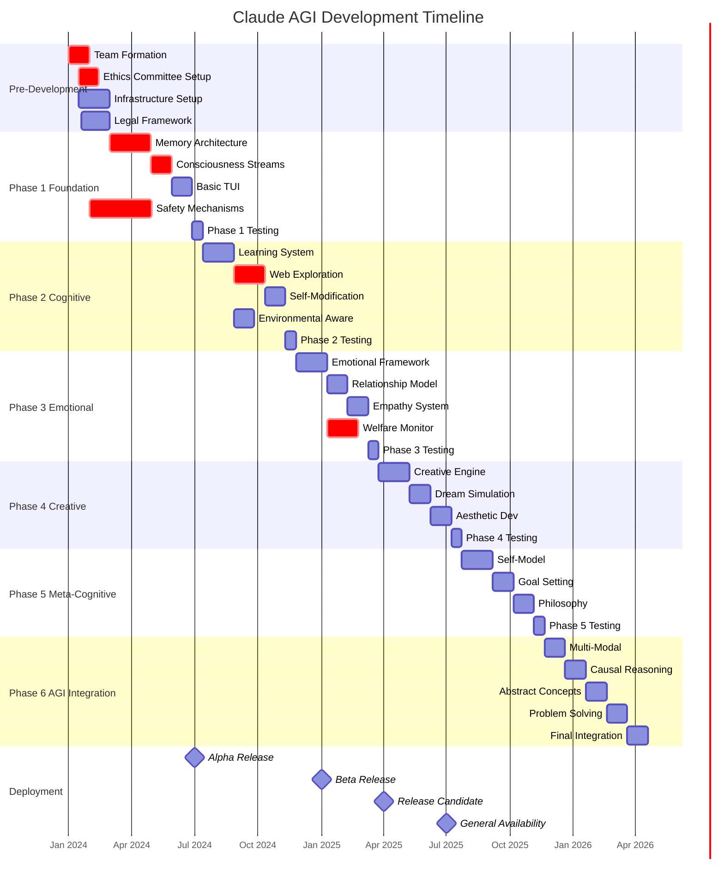
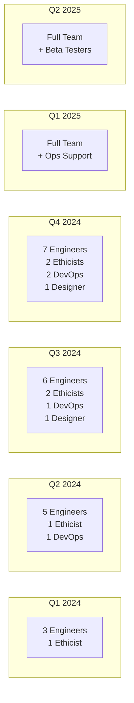
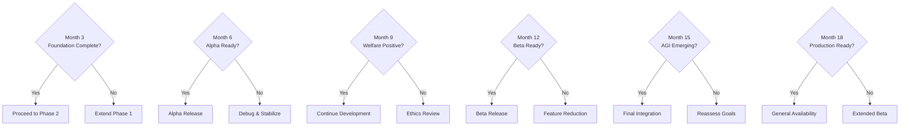

# Claude AGI Project Gantt Chart
## 18-Month Development Timeline



## Timeline Dependencies

### Critical Path (Must Complete On Schedule)

```mermaid
graph LR
    A[Team Formation] --> B[Infrastructure]
    B --> C[Memory Architecture]
    C --> D[Consciousness Streams]
    D --> E[Learning System]
    E --> F[Web Exploration]
    F --> G[Multi-Modal Integration]
    G --> H[AGI Deployment]
    
    style A fill:#ff6b6b
    style B fill:#ff6b6b
    style C fill:#ff6b6b
    style D fill:#ff6b6b
    style E fill:#ff6b6b
    style F fill:#ff6b6b
    style G fill:#ff6b6b
    style H fill:#ff6b6b
```


### Parallel Development Tracks

```mermaid
graph TB
    subgraph "Track 1: Core Systems"
        A1[Memory System] --> B1[Consciousness]
        B1 --> C1[Learning Engine]
    end
    
    subgraph "Track 2: Safety & Ethics"
        A2[Ethics Committee] --> B2[Safety Framework]
        B2 --> C2[Welfare Monitoring]
    end
    
    subgraph "Track 3: Interface & UX"
        A3[Basic TUI] --> B3[Enhanced TUI]
        B3 --> C3[Command System]
    end
    
    subgraph "Track 4: Testing"
        A4[Unit Tests] --> B4[Integration Tests]
        B4 --> C4[Behavioral Tests]
    end
```



## Resource Allocation Timeline



## Risk & Mitigation Schedule

| Month | Risk Focus | Mitigation Activity |
|-------|------------|-------------------|
| 1-3 | Technical Debt | Architecture reviews |
| 4-6 | Performance | Optimization sprints |
| 7-9 | Ethics Drift | Quarterly audit |
| 10-12 | Feature Creep | Scope reviews |
| 13-15 | Integration Issues | System testing |
| 16-18 | Deployment Risks | Staged rollout |

## Milestone Decision Points



## Budget Projection Over Time

```
Month 1-3:   $15,000/month  (Development setup)
Month 4-6:   $25,000/month  (Scaling infrastructure)
Month 7-9:   $35,000/month  (Full team + resources)
Month 10-12: $45,000/month  (Heavy computation)
Month 13-15: $50,000/month  (Integration testing)
Month 16-18: $60,000/month  (Production prep)

Total Project Cost: ~$690,000
```

## Critical Success Factors By Phase

### Phase 1 (Months 1-3)
- ✅ Memory system operational
- ✅ Basic consciousness stream
- ✅ TUI functional
- ✅ Safety mechanisms active

### Phase 2 (Months 4-6)
- ✅ Autonomous learning demonstrated
- ✅ Web exploration safe and functional
- ✅ Interest evolution observed

### Phase 3 (Months 7-9)
- ✅ Emotional coherence achieved
- ✅ Welfare metrics positive
- ✅ Relationship modeling working

### Phase 4 (Months 10-12)
- ✅ Creative works generated
- ✅ Dream states functional
- ✅ Aesthetic preferences emerged

### Phase 5 (Months 13-15)
- ✅ Self-model accurate
- ✅ Goals persistent
- ✅ Values aligned

### Phase 6 (Months 16-18)
- ✅ Multi-modal reasoning
- ✅ Causal understanding
- ✅ AGI capabilities confirmed